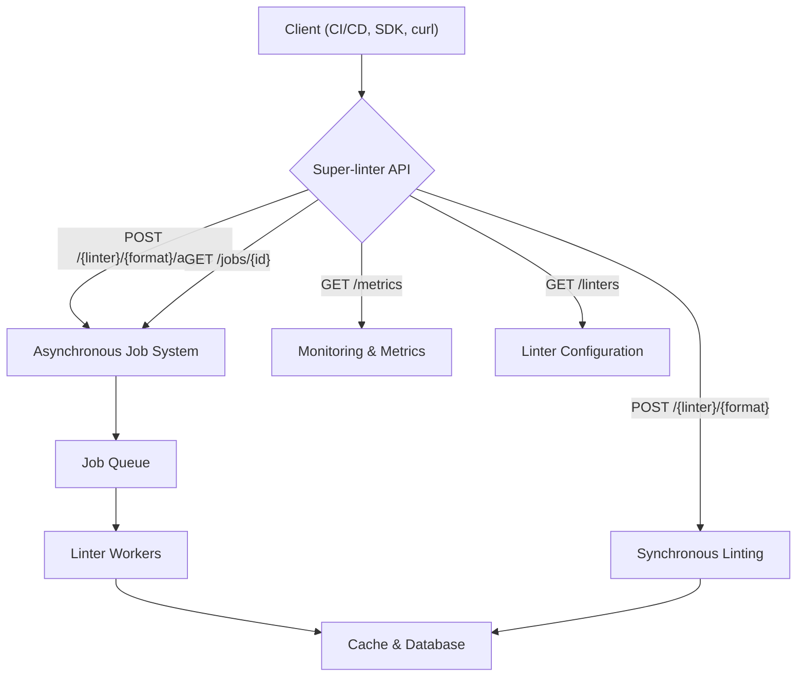

# API Reference

This section provides a complete technical reference for the Super-linter API. Here you will find detailed information on every endpoint, the data structures used in requests and responses, and a comprehensive list of error codes to help you build robust integrations. Whether you are performing a simple linting task or building a complex CI/CD workflow, this reference is your definitive guide to interacting with the API.

## API Architecture

The following diagram illustrates the high-level architecture of the API, showing how client requests are processed for synchronous linting, asynchronous jobs, and monitoring.



## Endpoints

The API is organized around REST principles, providing a clear and predictable structure for interacting with the linting service. Below is a summary of the available endpoints, grouped by functionality. For complete details on parameters, request bodies, and example responses, see the full [Endpoints Reference](./api-reference-endpoints.md).

| Endpoint                        | Method | Description          |
| ------------------------------- | ------ | -------------------- |
| `GET /`                         | GET    | API information      |
| `GET /health`                   | GET    | Health check         |
| `GET /linters`                  | GET    | Available linters    |
| `POST /{linter}/{format}`       | POST   | Synchronous linting  |
| `POST /{linter}/{format}/async` | POST   | Asynchronous linting |
| `GET /jobs/{job_id}`            | GET    | Job status/results   |
| `DELETE /jobs/{job_id}`         | DELETE | Cancel job           |
| `GET /metrics`                  | GET    | API metrics          |
| `DELETE /cache`                 | DELETE | Clear cache          |


## Data Types

All requests and responses use standard JSON data structures. Understanding these structures is key to interacting with the API effectively. Common data types include options for configuring linter behavior, detailed issue reports, and job status objects. For a complete definition of every data type, including `LinterOptions`, `LintResponse`, and `JobStatusResponse`, please consult the [Data Types Reference](./api-reference-data-types.md).

An example of the `options` object in a request body:
```json
{
  "options": {
    "validate_all": false,
    "exclude_patterns": ["node_modules/**"],
    "timeout": 30000,
    "fix": false,
    "rules": {
      "no-console": "warn"
    }
  }
}
```

## Error Codes

The API uses a standardized format for all error responses to ensure consistent and predictable error handling. All error responses include a `success: false` flag and an `error` object containing a unique `code` and a human-readable `message`. Below is a table of common error codes. For a complete list and detailed explanations, visit the [Error Codes Reference](./api-reference-error-codes.md).

| Code                      | HTTP Status | Description                   |
| ------------------------- | ----------- | ----------------------------- |
| `VALIDATION_ERROR`        | 400         | Invalid request parameters    |
| `INVALID_PARAMETERS`      | 400         | Invalid linter or format      |
| `JOB_NOT_FOUND`           | 404         | Job ID not found              |
| `TIMEOUT_ERROR`           | 408         | Request timeout               |
| `RATE_LIMIT_EXCEEDED`     | 429         | Too many requests             |
| `LINTER_EXECUTION_FAILED` | 500         | Linter execution error        |
| `INTERNAL_SERVER_ERROR`   | 500         | Server error                  |

---

Now that you have an overview of the API's structure, the best place to start is the detailed [Endpoints Reference](./api-reference-endpoints.md).