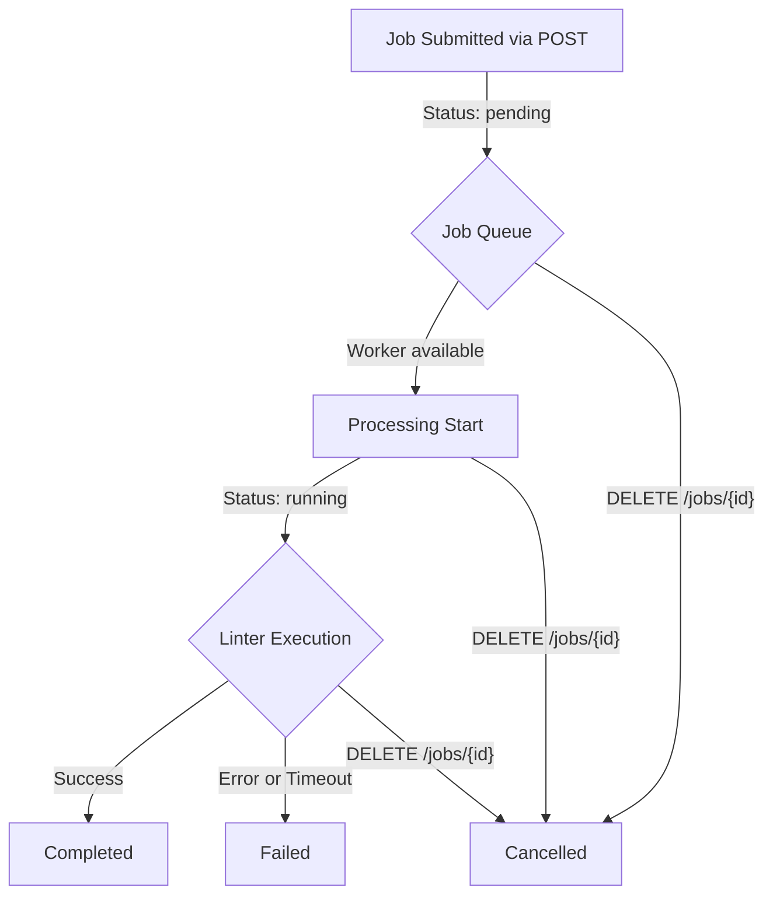
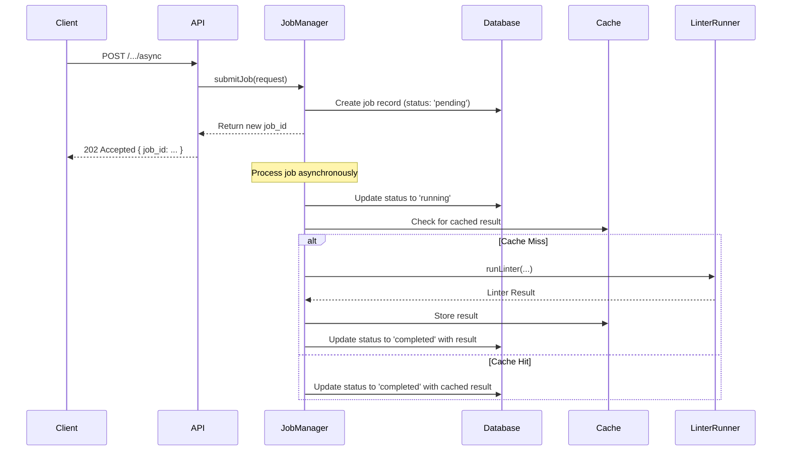

# Asynchronous Jobs

For large codebases or linters that take more than a few seconds to run, synchronous API requests can be impractical and may lead to timeouts. The asynchronous job system is designed to handle these long-running tasks efficiently. Instead of waiting for the linting process to complete, you can submit a job, receive a job ID immediately, and then poll for the status and results at your convenience.

This system manages a queue of tasks, processes them in the background, and persists the results, providing a robust solution for integrating linting into automated workflows and services.

## The Job Lifecycle

A job progresses through several distinct states from submission to completion. The following diagram illustrates the typical lifecycle of an asynchronous linting job.



| Status | Description |
|---|---|
| `pending` | The job has been successfully submitted and is waiting in the queue to be processed. |
| `running` | A worker has picked up the job and is actively executing the linter. |
| `completed` | The linter finished successfully. The results are available. |
| `failed` | The job failed due to a linter error, a timeout, or an internal system issue. An error message is available. |
| `cancelled` | The job was cancelled by a user request before it could complete. |

## Submitting a Job

To initiate an asynchronous linting task, send a `POST` request to the `/:linter/:format/async` endpoint. The request body is identical to the one used for synchronous requests, accepting either `content` or a base64-encoded `archive`.

**Endpoint:** `POST /:linter/:format/async`

**Example Request:**

```bash
curl -X POST "http://localhost:8080/api/pylint/json/async" \
     -H "Content-Type: application/json" \
     -d '{
       "content": "import os\n\ndef my_func():\n    print(\"hello\")\n",
       "options": {
         "fix": false
       }
     }'
```

The server will immediately respond with a `202 Accepted` status, confirming that the job has been queued. The response body includes a unique `job_id` and URLs to check the status or cancel the job.

**Example Response:**
```json
{
  "success": true,
  "job_id": "job_1678886400000_abcdef123",
  "status": "pending",
  "message": "Job submitted successfully",
  "status_url": "/jobs/job_1678886400000_abcdef123",
  "cancel_url": "/jobs/job_1678886400000_abcdef123"
}
```

## Checking Job Status

Once you have a `job_id`, you can poll the `/jobs/:id` endpoint to track its progress and retrieve the final result.

**Endpoint:** `GET /jobs/:id`

**Example Request:**
```bash
curl "http://localhost:8080/api/jobs/job_1678886400000_abcdef123"
```

The response structure varies based on the job's current status.

**Example Response (`running`):**
```json
{
    "success": true,
    "job_id": "job_1678886400000_abcdef123",
    "status": "running",
    "created_at": "2023-03-15T12:00:00.000Z",
    "started_at": "2023-03-15T12:00:05.000Z",
    "completed_at": null,
    "execution_time_ms": null
}
```

**Example Response (`completed`):**
When the job is complete, the `result` field will be populated with the linter output.
```json
{
    "success": true,
    "job_id": "job_1678886400000_abcdef123",
    "status": "completed",
    "created_at": "2023-03-15T12:00:00.000Z",
    "started_at": "2023-03-15T12:00:05.000Z",
    "completed_at": "2023-03-15T12:00:15.000Z",
    "execution_time_ms": 10000,
    "result": {
        "success": true,
        "exit_code": 0,
        "issues": [],
        "parsed_output": "..."
    }
}
```

**Example Response (`failed`):**
If the job fails, the `error` field will contain a description of the problem.
```json
{
    "success": true,
    "job_id": "job_1678886400000_abcdef123",
    "status": "failed",
    "created_at": "2023-03-15T12:00:00.000Z",
    "started_at": "2023-03-15T12:00:05.000Z",
    "completed_at": "2023-03-15T12:05:05.000Z",
    "execution_time_ms": 300000,
    "error": "Job timed out after 300000ms"
}
```

## Cancelling a Job

You can cancel a job that is in the `pending` or `running` state by sending a `DELETE` request. Jobs that are already `completed`, `failed`, or `cancelled` cannot be cancelled again.

**Endpoint:** `DELETE /jobs/:id`

**Example Request:**
```bash
curl -X DELETE "http://localhost:8080/api/jobs/job_1678886400000_abcdef123"
```

A successful cancellation returns a confirmation message.

**Example Response:**
```json
{
  "success": true,
  "job_id": "job_1678886400000_abcdef123",
  "status": "cancelled",
  "message": "Job cancelled successfully"
}
```
If you attempt to cancel a job that has already finished, the API will respond with a `409 Conflict` error.

## Internal Processing Flow

Behind the scenes, the `JobManager` orchestrates the entire process. The following diagram shows the sequence of events after a job is submitted.



This flow ensures that jobs are handled reliably, with state persisted in a database and performance optimized through the [Caching Layer](./concepts-caching.md). Server-side configurations like maximum concurrent jobs and job timeouts further ensure system stability.

For more details on specific endpoints, see the [API Reference](./api-reference-endpoints.md).