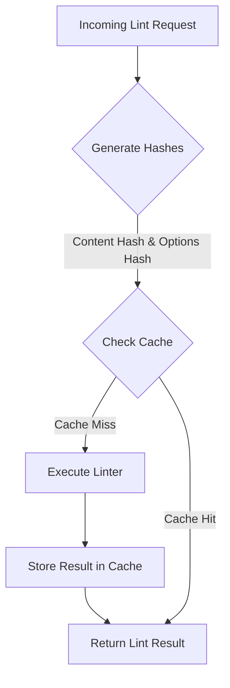

# Caching Layer

The Super-linter API incorporates a caching layer to significantly enhance performance and reduce server load. By storing the results of previous linting operations, the API can return responses for identical requests almost instantly, avoiding the need to re-run the linter. This mechanism is particularly effective in CI/CD environments where the same code might be linted multiple times.

The caching strategy relies on generating unique identifiers based on both the content being linted and the specific configuration options used for the request.

## How Caching Works

When a linting request is received, the API follows a simple process to determine if a valid cached result exists. This process involves generating unique hashes for the request's content and options, then querying the cache.

Here is a diagram illustrating the flow:



## Cache Key Generation

A unique cache key is generated for each unique combination of content, linter, output format, and linter options. This ensures that only identical requests receive a cached response. The key is composed of three main parts.

### 1. Content Hash

A `sha256` hash is generated from the file content (or buffer). This ensures that any change to the content, no matter how small, results in a different hash and a new cache entry.

```typescript
// Method for generating the content hash
function generateContentHash(content: string | Buffer): string {
  const hash = createHash('sha256');
  hash.update(content);
  return hash.digest('hex');
}
```

### 2. Options Hash

To ensure that changes in linter configuration are also reflected in the cache, a second `sha256` hash is generated from the linter options. To create a consistent hash, the options are first normalized: default values are applied, and array properties like `exclude_patterns` are sorted.

This normalized object is then stringified with its keys sorted alphabetically before being hashed. This guarantees that two options objects with the same settings but different key or array ordering will produce the same hash.

```typescript
// Options are normalized to ensure consistent hashing
const normalized = {
  validate_all: options.validate_all || false,
  exclude_patterns: (options.exclude_patterns || []).sort(),
  include_patterns: (options.include_patterns || []).sort(),
  log_level: options.log_level || 'INFO',
  timeout: options.timeout || 30000,
  fix: options.fix || false,
  config_file: options.config_file || '',
  rules: options.rules || {},
};

const optionsHash = createHash('sha256')
  .update(JSON.stringify(normalized, Object.keys(normalized).sort()))
  .digest('hex');
```

### 3. Final Cache Key

The final cache key combines the linter type, output format, content hash, and options hash into a single string.

**Format:** `${linter}:${format}:${contentHash}:${optionsHash}`

## Storage and Expiration

The API uses a two-level caching system:

1.  **In-Memory Cache**: A `Map` object provides extremely fast, short-term caching for immediate subsequent requests within the same process.
2.  **Database Cache**: A persistent SQLite database stores cache entries for longer-term use across different processes and application restarts. All cache entries are written to the database.

A cached result is stored as a `LintResult` object with the following structure:

| Field | Type | Description |
|---|---|---|
| `id` | `string` | A unique identifier for the cache entry. |
| `content_hash` | `string` | The SHA256 hash of the linted content. |
| `linter_type` | `string` | The name of the linter used (e.g., 'eslint'). |
| `options_hash` | `string` | The SHA256 hash of the normalized linter options. |
| `result` | `string` | The JSON string of the linting result. |
| `format` | `string` | The output format of the result. |
| `status` | `string` | The status of the operation ('success', 'error', 'timeout'). |
| `error_message` | `string` | Any error message, if the status is not 'success'. |
| `created_at` | `string` | The ISO 8601 timestamp when the entry was created. |
| `expires_at` | `string` | The ISO 8601 timestamp when the entry expires. |

By default, cache entries expire after 24 hours. This TTL (Time-To-Live) can be configured via the `default_ttl_hours` option.

## Cache Management

The service provides several methods for managing the cache lifecycle.

*   **Automatic Cleanup**: A background timer runs periodically to automatically delete expired entries from the database, preventing the cache from growing indefinitely with stale data.
*   **Manual Invalidation**: You can programmatically invalidate parts of the cache. The `invalidate` method allows clearing the cache with different levels of granularity:
    *   By a specific content hash.
    *   By a specific linter type.
    *   By a combination of content hash and linter type.
    *   Clearing the entire cache.
*   **Cache Warming**: For high-traffic applications, a `warmCache` method is available to pre-populate the cache with results for common files and configurations, ensuring that initial requests are served quickly.

---

Understanding the caching layer is key to optimizing your use of the Super-linter API. To see how caching fits into the broader request lifecycle, continue to the [Linting Execution](./concepts-linting-execution.md) section.