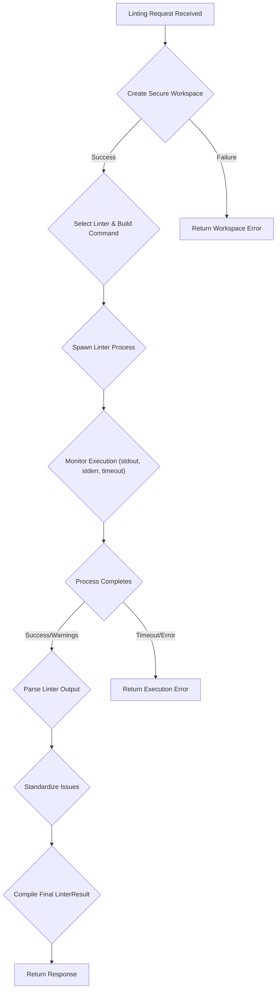
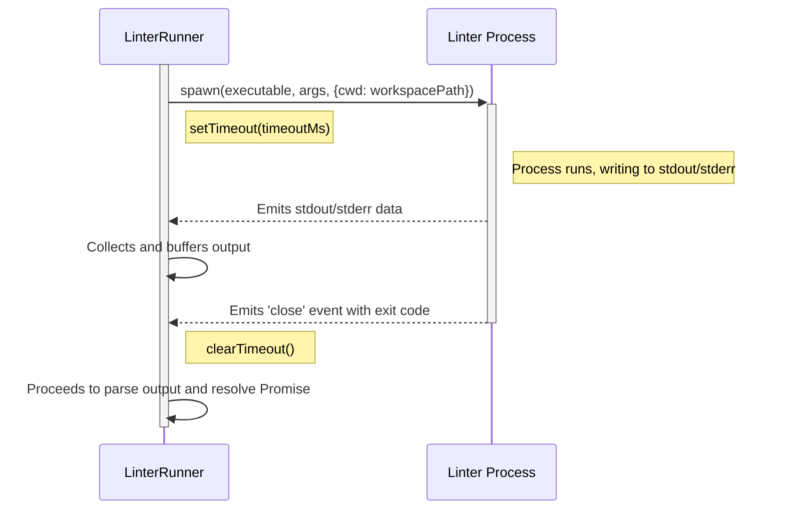

# Linting Execution

Every linting request initiates a systematic, multi-stage process designed to analyze code securely and efficiently. This lifecycle ensures that user-submitted code is handled in an isolated environment, executed against the correct linter with appropriate settings, and that the results are parsed into a standardized, easy-to-use format. Understanding this flow is key to interpreting API responses and troubleshooting issues.

The entire process can be visualized as follows:



Let's break down each major stage of the execution lifecycle.

## Stage 1: Workspace Creation and Validation

Before any code is analyzed, it must be placed into a secure, temporary workspace. This prevents any possibility of directory traversal attacks and isolates the execution environment.

1.  **Workspace Generation**: A unique directory is created on the server (e.g., `tmp/ws_1677654321_abcdef`).
2.  **Content Handling**: The API accepts code as plain text, a base64-encoded string, or a base64-encoded `tar.gz` archive. The system decodes the content and places it into the newly created workspace.
3.  **Validation**: The workspace content is rigorously validated against several constraints to ensure stability and security. If any of these checks fail, the process is aborted, and a `WorkspaceError` is returned.

| Constraint | Default Limit | Description |
| --- | --- | --- |
| `maxFileSize` | 10 MB | The maximum size for any single file. |
| `maxTotalSize` | 500 MB | The maximum total size of all files in the workspace. |
| `maxFiles` | 10,000 | The maximum number of files allowed in the workspace. |
| `allowedExtensions` | Set of common code extensions | Files with unlisted extensions (e.g., `.exe`, `.bin`) are ignored or rejected. |
| `blockedPaths` | `node_modules`, `.git`, `dist`, etc. | Common dependency and build artifact directories are blocked for security and performance. |


## Stage 2: Linter Process Execution

With a valid workspace, the system prepares and executes the requested linter.

1.  **Configuration Lookup**: The system retrieves the linter's configuration, which includes the executable name, default command-line arguments, supported file extensions, and environment variables.
2.  **Argument Building**: Command-line arguments are constructed. This starts with the base arguments (e.g., `['--format', 'json']` for ESLint) and appends user-provided options, such as specifying a configuration file (`--config .my-eslint.js`) or enabling auto-fixing (`--fix`).
3.  **Process Spawning**: The linter is executed as a child process using `child_process.spawn`. It runs within the context of the temporary workspace directory.

This execution flow includes robust handling for timeouts and process management.



If the process does not complete within the configured `timeout_ms` (e.g., 30000ms), it is terminated, and a `TimeoutError` is returned.

## Stage 3: Output Parsing and Standardization

The raw text output from a linter process is not directly useful for programmatic analysis. The next stage is to parse this output and convert it into a structured, standardized format.

1.  **Parsing Strategy**: The system first attempts to parse the output as JSON, as this is the preferred format for many linters (e.g., ESLint, Pylint, ShellCheck). If JSON parsing fails or is not supported, it falls back to a text-based parser. If all parsing fails, the raw output is returned.
2.  **Issue Standardization**: The parsed data, which varies significantly between linters, is mapped to a standard `LinterIssue` object. This provides a consistent structure for all reported issues, regardless of the source linter.

Here is an example of raw ESLint output and how it is transformed.

**Before: Raw Linter Output (stdout)**
```json
[
  {
    "filePath": "/tmp/ws_12345/src/index.js",
    "messages": [
      {
        "ruleId": "no-unused-vars",
        "severity": 2,
        "message": "'x' is assigned a value but never used.",
        "line": 2,
        "column": 7,
        "nodeType": "Identifier"
      }
    ],
    "errorCount": 1,
    "warningCount": 0,
    "fixableErrorCount": 0,
    "fixableWarningCount": 0
  }
]
```

**After: Standardized `LinterIssue` Array**
```json
{
  "issues": [
    {
      "file": "/tmp/ws_12345/src/index.js",
      "line": 2,
      "column": 7,
      "rule": "no-unused-vars",
      "severity": "error",
      "message": "'x' is assigned a value but never used.",
      "source": "eslint"
    }
  ]
}
```
This standardization simplifies client-side logic, as you only need to handle one data structure for issues from any supported linter.

## Stage 4: Compiling the Final Result

Finally, all collected information is assembled into a single `LinterResult` object. This object provides a complete summary of the execution.

It contains:
-   `success`: A boolean indicating if the process ran without critical errors (note: may be `true` even if linting issues are found).
-   `exit_code`: The numerical exit code from the linter process.
-   `stdout` & `stderr`: The raw, captured output streams.
-   `execution_time_ms`: The total time taken for the linter to run.
-   `file_count`: The number of files that were analyzed.
-   `parsed_output`: The structured output from the parser.
-   `issues`: The standardized array of `LinterIssue` objects.

This final object is then returned as the response to the API request, completing the linting lifecycle.

---

This core execution flow is the foundation of the service. To understand how multiple requests are managed and how performance is optimized for repeated requests, see the following sections:

*   **Next**: [Asynchronous Jobs](./concepts-async-jobs.md)
*   **See Also**: [Caching Layer](./concepts-caching.md)