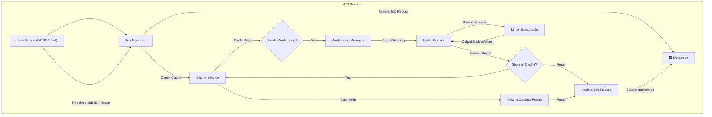

# Core Concepts

To use the Super-linter API effectively, it's helpful to understand its fundamental components and architecture. This section provides a high-level overview of the key systems that power the service: the linting execution process, the asynchronous job manager, and the intelligent caching layer.

Each component is designed to provide a reliable, scalable, and performant linting service. The following diagram illustrates how they work together to process a typical request.

### Linting Execution

The core of the service is its ability to execute linters against provided source code in a secure and isolated environment. When a request is processed, the API creates a temporary workspace, populates it with your code, and invokes the appropriate linter executable. It then captures and parses the output into a standardized JSON format, detailing any issues found.

This process involves handling various linters, managing timeouts, and ensuring that the execution environment is clean and secure for every run.

[Learn more about Linting Execution &raquo;](./concepts-linting-execution.md)

### Asynchronous Jobs

Linting an entire project can take time. To avoid long-running HTTP requests and provide a more robust experience, the API operates on an asynchronous job model. When you submit a linting request, the service immediately accepts it, creates a job, and returns a unique `job_id`.

You can then use this ID to poll for the job's status and retrieve the results once it's complete. This architecture allows the system to manage a queue of tasks efficiently, handle concurrency, and provide a non-blocking interface for clients.

[Learn more about Asynchronous Jobs &raquo;](./concepts-async-jobs.md)

### Caching Layer

To optimize performance and reduce redundant computations, the API includes a powerful caching layer. Before executing a linter, it calculates a unique hash based on both the content of your code and the specific linter options you've configured.

If an identical request has been processed before, the cached result is returned instantly, saving significant time and resources. This is particularly effective in CI/CD environments where the same code is often linted repeatedly.

[Learn more about the Caching Layer &raquo;](./concepts-caching.md)

---

Understanding these concepts will help you build more efficient and reliable integrations. To see how these components are exposed through the API, proceed to the [API Reference](./api-reference.md).