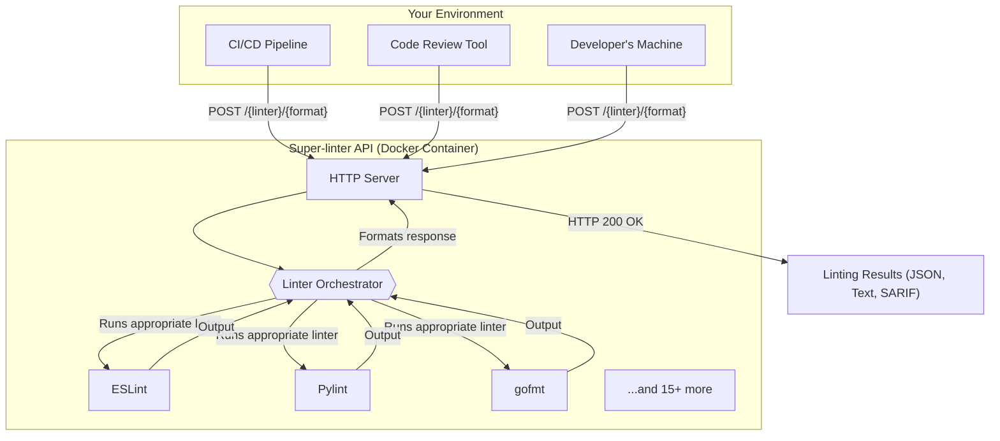

# Overview

Super-linter API provides a unified, production-ready HTTP interface for over 18 popular code linters. It's packaged as a single Docker container that you can run with one command, allowing you to start linting code for JavaScript, Python, Go, Ruby, and more in under 10 seconds via a simple REST API.

The main goal is to simplify code quality automation. Instead of managing multiple linter installations and configurations across different projects and CI/CD pipelines, you can deploy a single, centralized service that any tool can communicate with over HTTP.

## How It Works

The API acts as a central gateway for all linting requests. A client, such as a CI/CD job or a code editor plugin, sends a code snippet or a project archive to a specific endpoint. The API server receives the request, runs the corresponding linter in an isolated environment, and returns the results in a standardized format.



## Key Features

- **Multi-Linter Support**: Access 18+ linters for a wide range of languages through a single API.
- **Simple Deployment**: Runs as a single Docker container. Get started with `docker run`.
- **Synchronous & Asynchronous Linting**: Choose between immediate feedback for small snippets or background jobs for large codebases.
- **Flexible Inputs**: Send code as plain text, a JSON payload, or a base64-encoded `.tar.gz` archive for full project analysis.
- **Standardized Outputs**: Receive linting results in consistent `json`, `text`, or `sarif` formats, regardless of the linter used.
- **Built for Automation**: Ideal for integration into CI/CD pipelines, code review tools, and microservice architectures.

## Common Use Cases

Super-linter API is designed for scenarios where consistent and fast code quality checks are essential.

| Use Case | Description |
|---|---|
| **CI/CD Pipelines** | Add a fast, reliable linting step to your build and deployment workflows without installing multiple language toolchains on your runners. |
| **Code Review Tools** | Integrate with automated systems that check pull requests for style and quality issues, providing instant feedback to developers. |
| **Multi-language Projects** | Use one consistent API to lint a repository containing code in JavaScript, Python, Go, and YAML. |
| **Microservices** | Provide a centralized linting service for development teams to ensure code quality standards across a distributed architecture. |

## Example: Linting JavaScript

You can get the API running and lint your first piece of code in two commands.

1.  **Start the API server:**

    ```bash
    docker run -d -p 3000:3000 --name linter-api arcblock/super-linter-api:latest
    ```

2.  **Send a linting request:**

    ```bash
    curl -X POST http://localhost:3000/eslint/json \
      -H "Content-Type: application/json" \
      -d '{
        "content": "const unused = 42; console.log(\"Hello World\");",
        "filename": "demo.js"
      }'
    ```

**Response:**

```json
{
  "success": true,
  "execution_time_ms": 245,
  "issues": [
    {
      "file": "demo.js",
      "line": 1,
      "rule": "no-unused-vars",
      "severity": "error",
      "message": "'unused' is assigned a value but never used."
    }
  ]
}
```

This simple workflow forms the foundation for more complex automations.

---

Ready to try it yourself? Head over to the [Getting Started](./getting-started.md) guide for a step-by-step walkthrough.